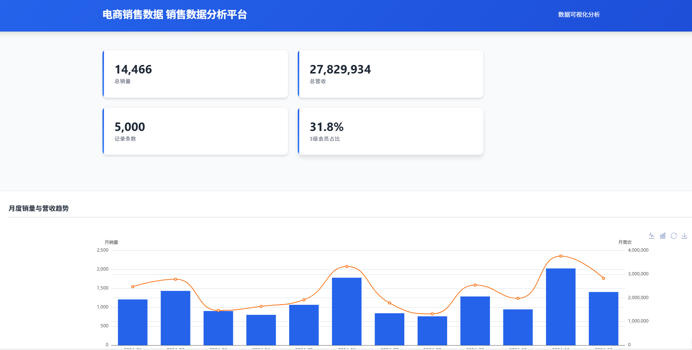

# 电商销售数据分析看板
- 项目：sim-ec-data-analysis
- 后端：Python Flask，前后端分离架构

# 项目简介
基于 **Python Flask + MySQL + ECharts + 原生 HTML/JS** 搭建电商销售数据可视化看板。
后端使用 Flask 编写 RESTful 接口，从 MySQL 读取销售数据，完成聚合统计；前端页面使用 ECharts 绘制各类可视化图表，支持图表一键切换、图片导出、重置视图等交互，从时间、品类、地域多维度展示电商销量与营收情况。

## 技术栈

- 后端：Python 3.x + Flask + pymysql + python-dotenv
- 数据库：MySQL 8.0
- 前端：HTML + CSS + JavaScript + ECharts
- 数据请求：Fetch API

## 项目目录结构

```
sim-ec-data-analysis/
├── .venv/                  # Python虚拟环境（git忽略）
├── backend/                # Flask后端
│   ├── db/
│   │   ├── __pycache__/
│   │   ├── .env            # 本地数据库配置（不提交git）
│   │   ├── .env.example    # 环境配置模板
│   │   ├── db.py           # 数据库连接封装
│   │   ├── db.sql          # MySQL建表与初始化SQL脚本
│   │   └── test_data.py    # 测试数据生成脚本
│   └── app.py              # Flask入口、API接口定义
├── frontend/               # 前端看板页面
│   ├── css/
│   │   └── style.css       # 页面样式
│   ├── js/
│   │   └── script.js       # ECharts图表逻辑
│   ├── node_modules/       # 前端依赖（git忽略）
│   ├── index.html          # 看板主页面
│   ├── package.json
│   └── package-lock.json
├── img/                    # 图片
├── README.md
└── .gitignore              # Git忽略文件配置
```

## 数据仓库设计（星型模型）
数据库名：`ecommerce_dw`，共6张表
| 表名 | 类型 | 数据量 | 说明 |
| ---- | ---- | ---- | ---- |
| `fact_order` | 事实表 | 5000 | 订单事实表，核心度量：订单量、销量、营收；关联各维度外键 |
| `dim_time` | 时间维度 | 366 | 日期维度，存储年、月、日，用于月度趋势统计 |
| `dim_goods` | 商品维度 | 20 | 商品/品类维度，用于品类销售分析 |
| `dim_area` | 地域维度 | 10 | 地区维度，用于地理销售分布 |
| `dim_user` | 用户维度 | 500 | 用户维度，用户分层分析 |
| `dim_pay` | 支付维度 | 3 | 支付方式维度 |

> 模型说明：事实表`fact_order`通过外键关联5张维度表，实现多维度切片、上卷聚合。
