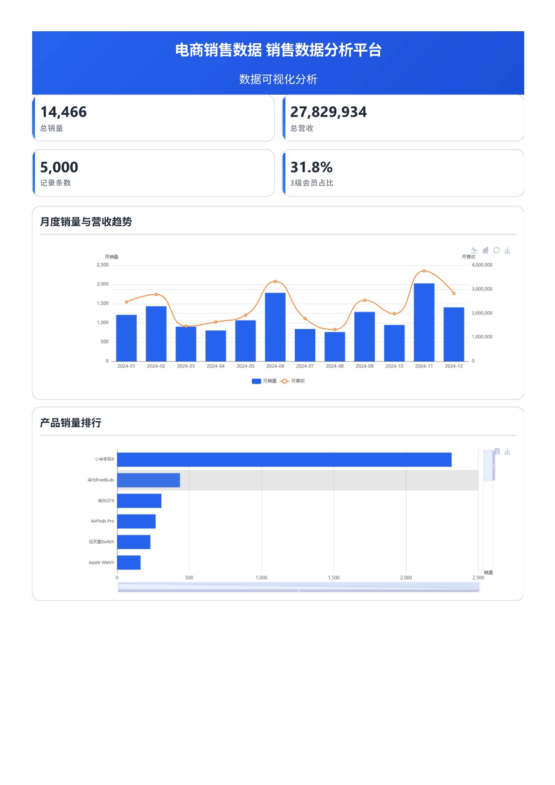
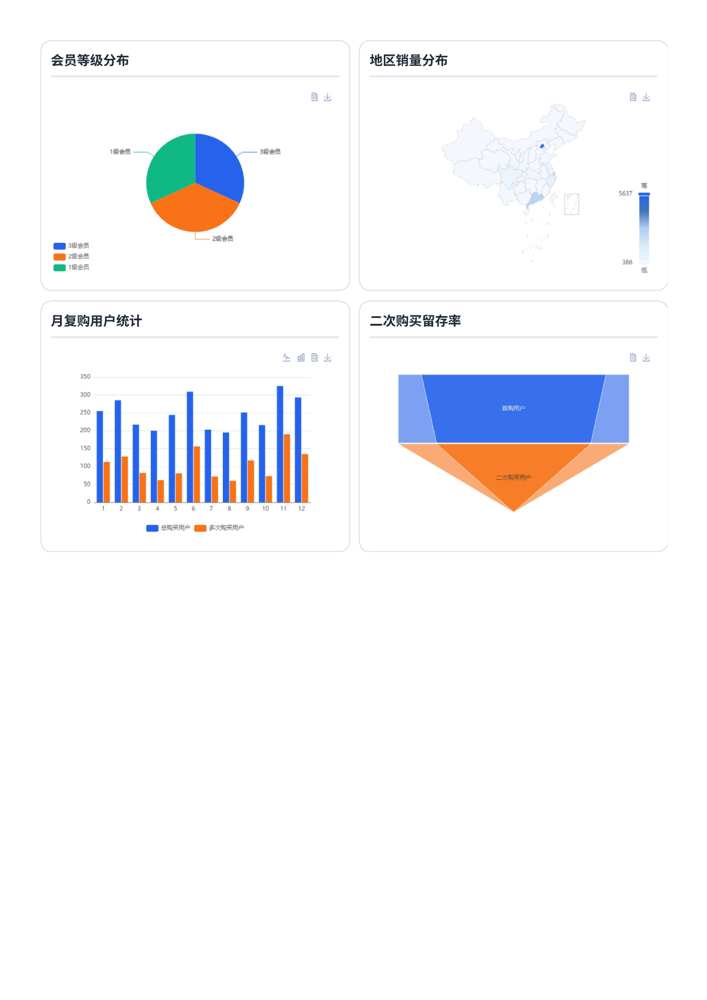
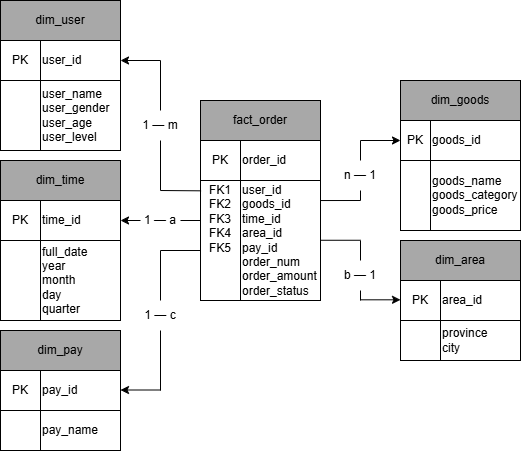

# 电商销售数据分析看板

> 基于 **Python Flask + MySQL + ECharts** 的电商销售数据可视化分析平台，采用「数据仓库星型模型 + RESTful 聚合接口 + 可视化大屏」的分层架构，从**时间、品类、地域、用户**多维度分析销量与营收，并延伸出**月复购率、二次购买留存率**等经营分析指标。

    




---

## ✨ 功能特性

| 模块 | 说明 |
| --- | --- |
| 🧮 **全局 KPI 总览** | 总销量、总营收、订单记录数、会员占比实时聚合展示 |
| 📈 **月度销量与营收趋势** | 柱线混合图（柱=销量，线=营收），支持一键切换 line/bar |
| 🏆 **产品销量排行** | 横向条形图 + 双向 dataZoom 缩放，聚焦 Top 商品 |
| 👤 **会员等级分布** | 饼图展示 1/2/3 级会员占比，支持数据视图导出 |
| 🗺️ **地区销量分布** | ECharts 中国地图 + visualMap 分级着色，各省销量一目了然 |
| 🔁 **月复购用户统计** | 每月「总购买用户 / 多次购买用户」对比柱图 |
| 🥇 **二次购买留存率** | 双层漏斗图对比「理想状态 vs 真实转化」，直观呈现留存漏斗 |
| 🖼️ **图表交互** | 全部图表内置 ECharts toolbox：一键切换图表类型、图片导出、视图重置、数据视图 |

---

## 🧰 技术栈

- **后端**：Python 3.8+ / Flask / pymysql / DBUtils 连接池 / python-dotenv
- **数据库**：MySQL 8.0（utf8mb4）
- **前端**：原生 HTML5 + CSS3 + JavaScript（ES6）/ ECharts 6.x（npm 安装）/ jQuery（CDN）
- **数据请求**：Fetch API（原生 Promise 异步加载，页面无刷新渲染）
- **架构**：前后端分离，Flask 同时托管前端静态资源

---

## 🏗️ 系统架构

```
浏览器（ECharts 可视化大屏）
        │  Fetch /api/*  （JSON）
        ▼
Flask RESTful API（app.py，8 个聚合接口）
        │  pymysql（DBUtils 连接池，最多 6 连接）
        ▼
MySQL 数据仓库 ecommerce_dw（星型模型）
        ▲
模拟数据生成（test_data.py，权重化仿真）
```

- **前后端分离**：前端仅通过 `fetch('/api/*')` 取数，后端只返回 `application/json`
- **静态托管**：`Flask(__name__, static_folder='../frontend')`，一套服务同时提供页面与接口
- **连接池**：复用 `DBUtils.PooledDB`，避免每次请求新建/销毁数据库连接

---

## 🗄️ 数据仓库设计（星型模型）

数据库名：`ecommerce_dw`，共 **6 张表**（1 张事实表 + 5 张维度表），事实表通过外键关联各维度表，支持多维度切片与上卷聚合。

| 表名 | 类型 | 数据量 | 说明 |
| ---- | ---- | ---- | ---- |
| `fact_order` | 事实表 | 5000 | 订单事实表，核心度量：`order_num`（销量）、`order_amount`（营收） |
| `dim_time` | 时间维度 | 366 | 2024 年每日一条（闰年 366 天），含年/月/日/季度，用于月度趋势 |
| `dim_goods` | 商品维度 | 20 | 20 款商品，覆盖手机/平板/笔记本/耳机/智能穿戴/游戏机/家电 7 大品类 |
| `dim_area` | 地域维度 | 10 | 10 个省市（北京/上海/广州/深圳/杭州/南京/成都/武汉/西安/济南） |
| `dim_user` | 用户维度 | 500 | 500 个用户，含性别/年龄/会员等级（1-3 级），用于用户分层 |
| `dim_pay` | 支付维度 | 3 | 微信 / 支付宝 / 银行卡 |

### 外键与索引设计

```sql
-- 事实表外键（约束完整性）
FOREIGN KEY (user_id) REFERENCES dim_user(user_id),
FOREIGN KEY (goods_id) REFERENCES dim_goods(goods_id),
FOREIGN KEY (time_id) REFERENCES dim_time(time_id),
FOREIGN KEY (area_id) REFERENCES dim_area(area_id),
FOREIGN KEY (pay_id) REFERENCES dim_pay(pay_id)

-- 聚合查询索引（每个外键列建索引，加速 group by / join）
CREATE INDEX idx_fact_user  ON fact_order(user_id);
CREATE INDEX idx_fact_goods ON fact_order(goods_id);
CREATE INDEX idx_fact_time  ON fact_order(time_id);
CREATE INDEX idx_fact_area  ON fact_order(area_id);
CREATE INDEX idx_fact_pay   ON fact_order(pay_id);
```

> 模型说明：事实表 `fact_order` 通过外键关联 5 张维度表，实现多维度切片、上卷聚合。索引面向「按维度 join 后的聚合统计」场景设计。



---

## 🔌 API 接口列表

> 所有接口均返回 `application/json`，前端通过 `fetch('/api/*')` 调用。服务地址：`http://127.0.0.1:8080`

| 方法 | 路径 | 说明 | 主要返回字段 |
| --- | --- | --- | --- |
| GET | `/` | 看板主页面（Flask 托管静态资源） | HTML |
| GET | `/api/summary` | 全局 KPI 总览 | `total_quantity` 总销量、`total_revenue` 总营收、`total_records` 记录条数、`avg_member` 会员占比 |
| GET | `/api/monthly` | 月度销量与营收趋势 | `month_year`（如 2024-06）、`total_quantity`、`total_revenue` |
| GET | `/api/products` | 商品销量排行 | `goods_name`、`total_amount`（订单数） |
| GET | `/api/members` | 会员等级分布 | `user_level`、`member_count` |
| GET | `/api/regions` | 地区销量与营收 | `region_name`、`total_quantity`、`total_revenue` |
| GET | `/api/regions-sales` | 各省份销量（中国地图数据源） | `province`、`total_quantity` |
| GET | `/api/repurchase` | 月复购用户统计 | `order_month`、`rpc_user`（复购用户）、`total_user`、`repurchase_rate`（复购率） |
| GET | `/api/conversion` | 二次购买留存率 | `first_buy_user`（首购用户）、`repurchase_2nd_user`（二次购买用户）、`total_second_buy_rate` |

**示例**：`GET /api/monthly`

```json
[
  { "month_year": "2024-01", "total_quantity": 1480, "total_revenue": 1826350.00 },
  { "month_year": "2024-02", "total_quantity": 1520, "total_revenue": 1894200.00 }
]
```

---

## 🚀 快速开始

### 1. 环境准备

| 依赖 | 版本要求 |
| --- | --- |
| Python | 3.8+ |
| MySQL | 8.0+ |
| Node.js / npm | 可选（仅前端 ECharts 依赖本地安装时需要） |

### 2. 创建虚拟环境并安装后端依赖

```bash
python -m venv .venv
.venv\Scripts\activate          # Windows
# source .venv/bin/activate    # macOS / Linux

pip install flask pymysql dbutils python-dotenv
```

### 3. 安装前端依赖

```bash
cd frontend
npm install                     # 安装 echarts（仓库内 node_modules 缺失时需要）
```

### 4. 初始化数据库

在 MySQL 中执行 `backend/db/db.sql`，创建数据库与全部 6 张表：

```bash
mysql -u root -p < backend/db/db.sql
```

### 5. 配置数据库连接

创建/修改 `backend/db/.env`（键名与 `backend/db/db.py` 中 `os.getenv()` 读取**必须完全一致**）：

```ini
DB_HOST=127.0.0.1
DB_PORT=3306
DB_USER=root
DB_PASSWORD=your_password
```

> ⚠️ **注意**：`os.getenv()` 区分大小写，`.env` 中的键名必须与 `db.py` 保持一致（如 `DB_HOST`）。`.env` 含敏感信息已被 `.gitignore` 忽略，请勿提交到仓库。

### 6. 生成模拟数据（可选，已有数据可跳过）

```bash
cd backend
python db/test_data.py
```

> ⚠️ 脚本 `backend/db/test_data.py`（AI 生成）中 `DB_CONFIG` 为硬编码连接信息，请按本机实际密码修改后再运行。脚本会**自动清理旧表并重建**，最终精确生成 5000 条订单事实数据。

### 7. 启动服务

```bash
cd backend
python app.py
```

看到 `Running on http://0.0.0.0:8080` 后，浏览器访问 **http://127.0.0.1:8080** 即可查看看板。

---

## 🧪 模拟数据生成逻辑

`test_data.py` 通过**带权重的偏斜分布**模拟真实电商业务规律：

| 维度 | 模拟策略 | 业务依据 |
| --- | --- | --- |
| 用户购买次数 | 正态分布 `N(μ=15, σ=7)`，截断至 1~60 次 | 真实用户购买频次近似正态，长尾重度用户存在 |
| 商品 | 权重与单价成反比 `1/price` | 低价商品走量、高价商品低频 |
| 时间（月份） | 1、2 月 1.4/1.5（春节）、6 月 1.8（618）、9 月 1.3（开学季）、11 月 2.0（双 11）、12 月 1.6 | 贴合电商大促与季节周期 |
| 地区 | 权重 `1/area_id^1.1`，ID 越小（北上广深杭）销量越高 | 一线城市购买力强、东部多于西部 |
| 支付方式 | 微信 : 支付宝 : 银行卡 ≈ 5 : 3 : 2 | 主流支付占比真实分布 |
| 订单状态 | 已支付 90% / 已取消 10%（无未支付历史单） | 历史订单口径 |
| 购买数量 | 长尾分布：1~2 件为主（55%），少量大单 | 电商客单价分布 |

脚本内置 `verify_data()` 完整性校验：外键孤立数据检查、总金额统计、品类/月份/地区/支付分布验证。

---

## 📁 项目目录结构

```
sim-ec-data-analysis/
├── .venv/                  # Python 虚拟环境（git 忽略）
├── backend/                # Flask 后端
│   ├── db/
│   │   ├── __pycache__/    # Python 缓存（git 忽略）
│   │   ├── .env            # 本地数据库配置（git 忽略，不提交）
│   │   ├── db.py           # 数据库连接池封装（DBUtils PooledDB）
│   │   ├── db.sql          # MySQL 建库建表 SQL（6 张表 + 索引）
│   │   └── test_data.py    # 模拟数据生成 + 完整性校验脚本（AI 生成）
│   └── app.py              # Flask 入口 + 8 个 RESTful 聚合接口
├── frontend/               # 前端看板页面
│   ├── css/
│   │   └── style.css       # 页面样式：响应式 + @media print 打印样式（AI 生成）
│   ├── js/
│   │   └── script.js       # ECharts 图表逻辑（Fetch API 取数渲染）
│   ├── static/
│   │   └── china.json      # 中国地图 GeoJSON（ECharts 地图数据源）
│   ├── node_modules/       # 前端依赖（git 忽略）
│   ├── index.html          # 看板主页面
│   ├── package.json        # 前端依赖声明（echarts）
│   └── package-lock.json
├── img/                    # 截图/ER 图
├── README.md
└── .gitignore              # Git 忽略配置（.env / 虚拟环境 / 缓存）
```

---

## ❓ 常见问题

| 问题 | 排查方法 |
| --- | --- |
| 数据库连接失败 `int(None)` / `KeyError` | `.env` 键名大小写与 `db.py` 中 `os.getenv("DB_*")` 不一致；或 MySQL 未启动、密码错误 |
| 8080 端口被占用 | 修改 `app.py` 末尾 `app.run(port=8080)` 的端口，同时访问对应地址 |
| 图表空白 / 地图不显示 | **必须通过 `http://127.0.0.1:8080` 访问**，直接双击 `index.html`（file:// 协议）会导致 `fetch('/api/*')` 与 `china.json` 加载失败 |
| 数据为 0 或图表无数据 | 确认已执行 `db.sql` 并运行 `test_data.py`，`fact_order` 表存在数据 |
| 页面有样式但接口报 404 | 请求路径需从 `/api/` 开头，与 `app.py` 路由一致 |

---

## 📜 说明

- 本项目为电商数据仓库 + 可视化分析学习实践项目，数据为脚本生成的模拟数据
- 图表均支持 ECharts toolbox 交互（切换类型 / 导出图片 / 重置视图 / 数据视图）
- 打印样式已针对浏览器纸张输出优化（`@media print`），可直接 Ctrl+P 导出报表
- **AI 生成声明**：`backend/db/test_data.py`（仿真数据生成脚本）与 `frontend/css/style.css`（前端样式）由 AI 辅助生成，保留人工审校；其余代码（后端接口、前端图表逻辑、SQL 建模）为人工编写